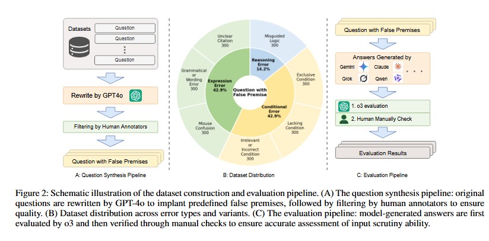
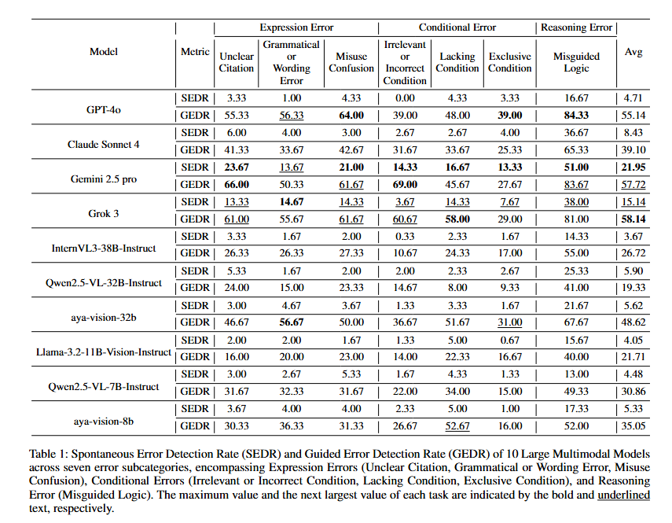

# Can Large Multimodal Models Actively Recognize Faulty Inputs? A Systematic Evaluation Framework of Their Input Scrutiny Ability


<div align="center">
  <a href="https://arxiv.org/abs/2508.04017">
    <strong>📃 Paper</strong>
  </a>
  •
  <a href="">
    <strong>🤗 Dataset</strong>
  </a>
  •
  <a href="https://github.com/MLGroupJLU/LMM_ISEval">
    <strong>🖥️ Code</strong>
  </a>
</div>

## Updates
[2025/08] We released codes for this project.

## Contents
- [Introduction](#introduction)
- [Key Findings](#key-findings)
- [Data Construction](#data-construction)
- [Install](#install)
- [Run Code](#run-code)
- [Citation](#citation)

## Introduction


Large Multimodal Models (LMMs) have witnessed remarkable growth, showcasing formidable capabilities in handling intricate multimodal tasks with exceptional performance. Recent research has underscored the inclination of large language models to passively accept defective inputs, often resulting in futile reasoning on invalid prompts. However, the same critical question of whether LMMs can actively detect and scrutinize erroneous inputs still remains unexplored. To address this gap, we introduce the Input Scrutiny Ability Evaluation Framework (ISEval), which encompasses seven categories of flawed premises and three evaluation metrics. Our extensive evaluation of ten advanced LMMs has identified key findings. Most models struggle to actively detect flawed textual premises without guidance, which reflects a strong reliance on explicit prompts for premise error identification. Error type affects performance: models excel at identifying logical fallacies but struggle with surface-level linguistic errors and certain conditional flaws. Modality trust varies-Gemini 2.5 pro and Claude Sonnet 4 balance visual and textual info, while aya-vision-8b over-rely on text in conflicts. These insights underscore the urgent need to enhance LMMs’ proactive verification of input validity and shed novel insights into mitigating the problem. 

## Contribution

- We introduce **ISEval**, a novel and comprehensive evaluation framework specifically engineered to assess the input scrutiny abilities of Large Multimodal Models (LMMs), which is built upon a meticulously curated dataset incorporating seven distinct categories of erroneous premises.
- We conducted a systematic evaluation of 10 state-of-the-art LMMs against the ISEval benchmark. This provides a detailed and nuanced understanding of their capabilities in scrutinizing input validity. 
- There is no consistent correlation between a model’s reasoning capability and its ability to critique premises. Some reasoning models internally catch inconsistencies but fail to articulate them outwardly.
- Our in-depth analysis of model performance yields three significant findings. These insights illuminate crucial limitations in LMMs' proactive assessment of input validity and shed light on how their modal preferences influence their responses to faulty information.

## Data Construction

We construct **PCBench** to systematically evaluate LLMs' premise critique abilities for erroneous inputs via a structured process:  
1. **Error Categories**: Define 4 types of premise errors to assess model capabilities in identifying flawed inputs.  
2. **Difficulty Levels**:  
   - Normal: From GSM8K dataset  
   - Medium: Adapted from Chinese College Entrance Examination (OlympiadBench)  
   - Difficult: From Omni-MATH (difficulty >6)  
3. **Problem Variants** for each base problem (error category + difficulty):  
   - **Original Problem**: Correct premises (baseline).  
   - **Flawed Problem**: Intentional errors in premises (to test autonomous critique).  
   - **Flawed Problem with Explicit Instruction**: Adds prompts to check for errors (comparative reference).  

**Scale**: 100 base problems per error-difficulty combination → 1,200 base problems → 3,600 problems (3 variants each).  
Designed to analyze how error type and task complexity impact premise critique ability.
<p align="center" width="90%">
<a ></a>
</p>

## Results

<p align="center" width="80%">
<a ></a>
</p>


## Run Code

### Inference
Run following commad to get LMM's responses.

```bash
python data_synthesis\inference.py --model_name <model_name>
```

### Evaluation
Run following commad to get o3's evaluation result to corresponding responses.

```bash
python evaluation\evaluate.py --model_folder <model_responses> --model_name <model_name>
```

## Citation
```
@misc{yang2025largemultimodalmodelsactively,
      title={Can Large Multimodal Models Actively Recognize Faulty Inputs? A Systematic Evaluation Framework of Their Input Scrutiny Ability}, 
      author={Haiqi Yang and Jinzhe Li and Gengxu Li and Yi Chang and Yuan Wu},
      year={2025},
      eprint={2508.04017},
      archivePrefix={arXiv},
      primaryClass={cs.CV},
      url={https://arxiv.org/abs/2508.04017}, 
}
```
Please cite our paper if you find our research and code useful.
